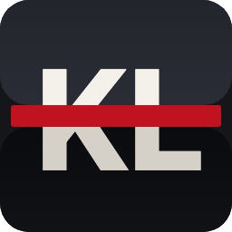
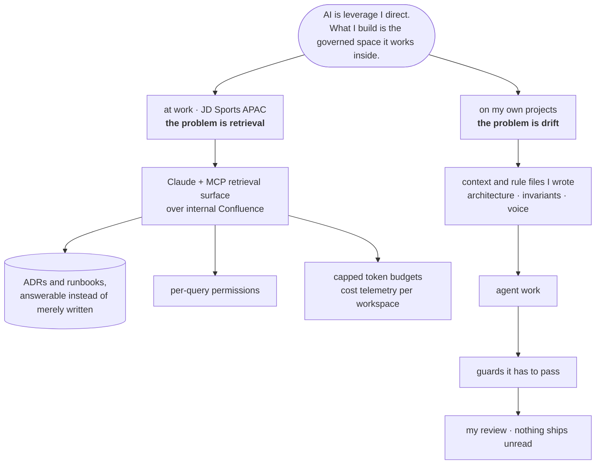

<h1 align="center">Klaus Lila</h1>

  <b>Tech Lead · JD Sports APAC · Sydney</b> 
  7+ years connecting legacy systems and modern platforms across Europe and APAC.

  
  
  
  

  
  
  
  
  
  
  
  
  
  
  
  
  
  

Four years at Deloitte before this, six engagements, from an Italian luxury fashion house to a British
carmaker. Most of what I build at work is private. Two projects are mine, and both have a full technical
write-up.

---

###  [skaisearch](https://skaisearch.com) &nbsp;·&nbsp; [**read the write-up →**](https://github.com/klauslila/skaisearch-showcase)

A flight price tracker that collects its own data and trains its own AI model, running on a Mac Mini at home
for about **$1 a day**. Measured 2026-07-26:

<!-- stats:start:strip · generated from the live database, do not hand-edit -->
**11.2M+** prices · **1.28M+** flights · **35** active routes · **5.0 GB** on disk ·
collecting since 2026-02-02.
<!-- stats:end:strip -->

Two surfaces, both open without an account: a [public model page](https://skaisearch.com) with an
interactive AI model console, and [the app](https://skaisearch.com/app) that opens as a read-only guest.
The model retrains nightly and ships only if it beats the previous one on fares it has never seen. The
write-up covers the architecture, the promotion gate, and why the forecaster is built but switched off.

###  [klauslila.com](https://klauslila.com) &nbsp;·&nbsp; [**read the write-up →**](https://github.com/klauslila/klauslila-showcase)

My own site. The hero is **real ADS-B traffic**, polled every 15 seconds through a Cloudflare Pages Function
that pins its own bounds, shares one upstream request between concurrent visitors, and serves slightly stale
planes rather than an empty sky. One HTML file, no build step, so it opens from `file://` too.

There is a puzzle in it. Nobody has mentioned it yet.

---

### 🧠 AI in my workflow

AI is leverage I direct. What I build is the governed space it works inside, and that is two different
problems depending on where I am.

At work the useful move was making internal decisions **answerable** rather than writing more of them. A
token budget that used to be gone by mid-morning now carries a full sprint, which is what makes running two
programmes at once possible.

On my own projects the problem runs both ways: an agent forgetting a constraint, and me forgetting to check.
So the repository pushes back.

| Guard | Catches |
|---|---|
| SQL dialect linter, pre-commit | The dialect slips agents make in a codebase migrated off SQLite |
| Doc-sync hook, pre-push | Code that changed without its documentation |
| Nightly regeneration | Any published number drifting from the database |
| Champion and challenger gate | A model that looks better and is not, so the call needs no human |
| Written voice and content rules | The tells that made early drafts read like a machine wrote them |

Each one started as a correction I made more than once. That is the pattern: a repeated correction becomes a
rule the repository enforces, so it stops depending on my attention. The single thing never delegated is
whether something is good enough to ship.

**→ [The full architecture, in the skaisearch write-up](https://github.com/klauslila/skaisearch-showcase#-ai-in-my-workflow)**

  klaus.lila.au@gmail.com 
  © 2024-2026 Klaus Lila. All rights reserved. Not licensed for reuse.

